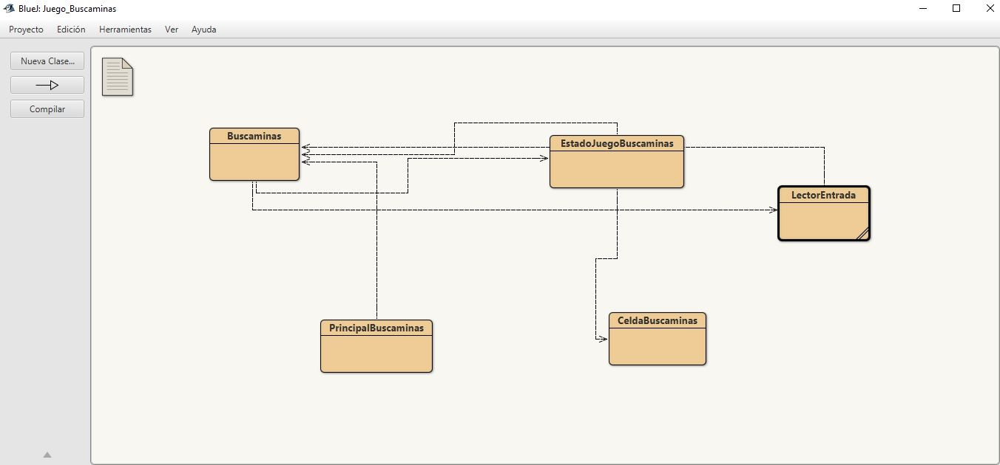

# 🎮 Proyecto Buscaminas (Java - Consola)

Este proyecto fue desarrollado como parte de la materia **Introducción a los Algoritmos**, aplicando los conceptos aprendidos en los **primeros 7 capítulos del libro _"Programación Orientada a Objetos con Java usando BlueJ"_** de Barnes y Kölling.

Se trata de una versión por consola del clásico juego **Buscaminas**, completamente implementado en **Java**, jugable desde la terminal.

---

## 🚀 ¿Qué incluye este proyecto?

- ✅ **Lógica completa** del juego (minas, celdas abiertas, bloqueadas, etc.).
- 🔄 **Apertura automática en cascada** si una celda sin minas vecinas es abierta.
- 🧠 **Clase EstadoJuegoBuscaminas** que gestiona todo el estado interno del juego.
- 🎯 **Validación de entrada** del usuario por comandos de texto (abrir, bloquear, desbloquear).
- 🧱 **Estructura de clases clara**, con buen diseño orientado a objetos.
- 📄 **Documentación Javadoc** en el código.
- 🧪 Fácil de ejecutar desde BlueJ o desde la consola de comandos.

---

## 📷 Vista previa desde consola

---

## 🧩 Clases principales

- `Buscaminas`: clase principal del proyecto. Contiene el `main` que inicia el juego.
- `EstadoJuegoBuscaminas`: gestiona el tablero, minas, y lógica del juego.
- `CeldaBuscaminas`: representa una celda individual del tablero.
- `LectorEntrada`: se encarga de leer y validar los comandos del usuario.

---

## 💻 Cómo jugar

Desde la consola, ingresar comandos con el siguiente formato:

<comando> <fila> <columna>

- **Comandos válidos:**
  - `abrir`: abre la celda seleccionada.
  - `bloquear`: bloquea una celda para no abrirla accidentalmente.
  - `desbloquear`: quita el bloqueo de una celda.

- **Ejemplo de uso:**

abrir 2 3
bloquear 1 4
desbloquear 1 4

---

## 📦 Requisitos

- Java 8 o superior
- Editor o entorno de desarrollo (recomendado: [BlueJ](https://bluej.org/))

---

👤 Autor
Ivo Mirko Elian Narváez
📧 ivomirkoelian22@gmail.com
